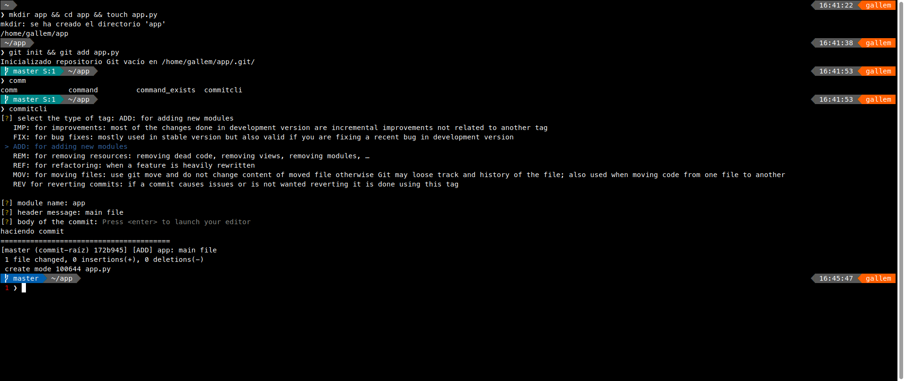

# Commit Cli

This project provides a cli to make git commits usings convetions in a terminal wizard like:

- [Conventional commits (default)](https://www.conventionalcommits.org/en/v1.0.0/)
- [odoo format](https://www.odoo.com/documentation/17.0/contributing/development/git_guidelines.html)
- Sematic Git Commits
- AI Autogenerated -> Wip using ollama

Checkit out on [pypi](https://pypi.org/project/commitcli/).

Is a wrapper of the `git commit -m` command writed with 💟 on Python.

This was tested on a raspbian and a fedora OS with the nano, nvim and vim editor.

## Features

### Commitcli configuration file per project

You can add a `.commitclirc` file in your project directory.

you can copy the global `.commitclirc` file to your project directory and edit it to use a diferent format.

```shell
cp ~/.commitclirc .commitclirc
```

### Conventional Commits Scope Cache

This tool uses a localfile `.ignore.commitcli_modules` to store the modules that you have already used in your commits and let you choose them on new commits.

but you can also use mongodb to store this cache, update on the `.commitclirc` file:

```shell
## ===============================================================
# from this default content in ~/.commitclirc

#Format for every commit
#supported formats free, odoo, sgc(semantic git commits) and cc (conventional commits)
format=cc

#Option to sign the commits o every commit, must be True or False
signgpg=False

#db configuration
db=localfile
db_url=localhost
db_port=27017
db_name=commitcli
#db_user=none
#db_password=none

## ===============================================================
# to this new content

#Format for every commit
#supported formats free, odoo, sgc(semantic git commits) and cc (conventional commits)
format=cc

#Option to sign the commits o every commit, must be True or False
signgpg=False

#db configuration
db=mongodb
db_url=localhost
db_port=27017
db_name=commitcli
#db_user=none -> just enable this if you have a user and password
#db_password=none -> just enable this if you have a user and password

```

## Installation

### 1 - Install the package

note : use sudo if the local (user) python bin dir is not in the path

```shell
sudo pip install commitcli
```

example content of the `.commitclirc` file:
```shell
#Format for every commit
#supported formats free, odoo, sgc(semantic git commits) and cc (conventional commits)
format=odoo

#Option to sign the commits o every commit, must be True or False
signgpg=False
```

change this to use cc on your project:
```shell
#Format for every commit
#supported formats free, odoo, sgc(semantic git commits) and cc (conventional commits)
format=cc

#Option to sign the commits o every commit, must be True or False
signgpg=False
```

save this file and add to your git repository and every comand will use cc format on this project.

### 2 - Enjoy

Add files to commit

```shell
git add .
```


Use the tool

```shell
commitcli
```

### Example

#### Odoo (default)



## Configuration

This utility creates a file into the users home directory `~/.commitclirc` in this file you will find some customizable options. the most important is the format option this option accepts this formats:

- cc
- odoo
- free


## Next Updates
- [ ] only make a echo of a format
- [ ] cli inline option to specify format (oddo, sgc, etc)
- [ ] module list to chose for context in cc or something like this `type(context)`
- [ ] quick templates
  - clean up
- [ ] smarter
  - store module list and provide a list of modules to choose from and the last by default

#### Formats

- [x]  conventional commits [CC](https://www.conventionalcommits.org/en/v1.0.0/) 
- [x]  semantic git commit [SGC](https://www.npmjs.com/package/semantic-git-commit-cli)
- [x]  odoo tags [Odoo](https://www.odoo.com/documentation/14.0/reference/guidelines.html#git)


## Development


## Help

using without install from the source 

python -m commitcli


## References

https://magmax.org/python-inquirer/

https://python-packaging.readthedocs.io/en/latest/command-line-scripts.html

https://setuptools.readthedocs.io/en/latest/userguide/entry_point.html

https://medium.com/better-programming/python-click-building-your-first-command-line-interface-application-6947d5319ef7